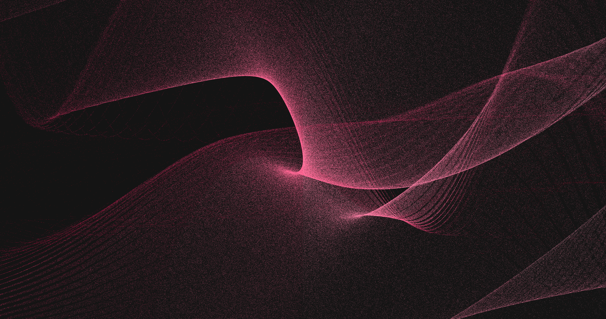
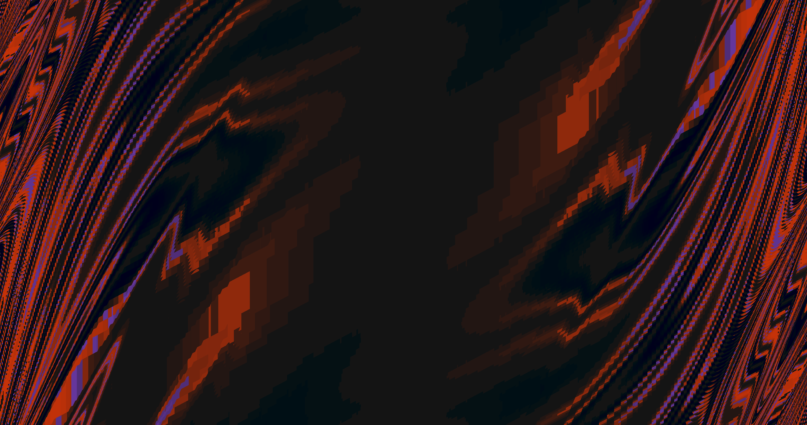
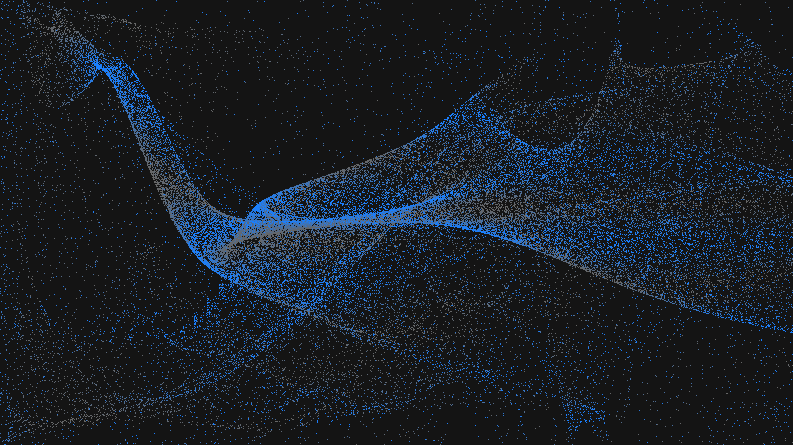
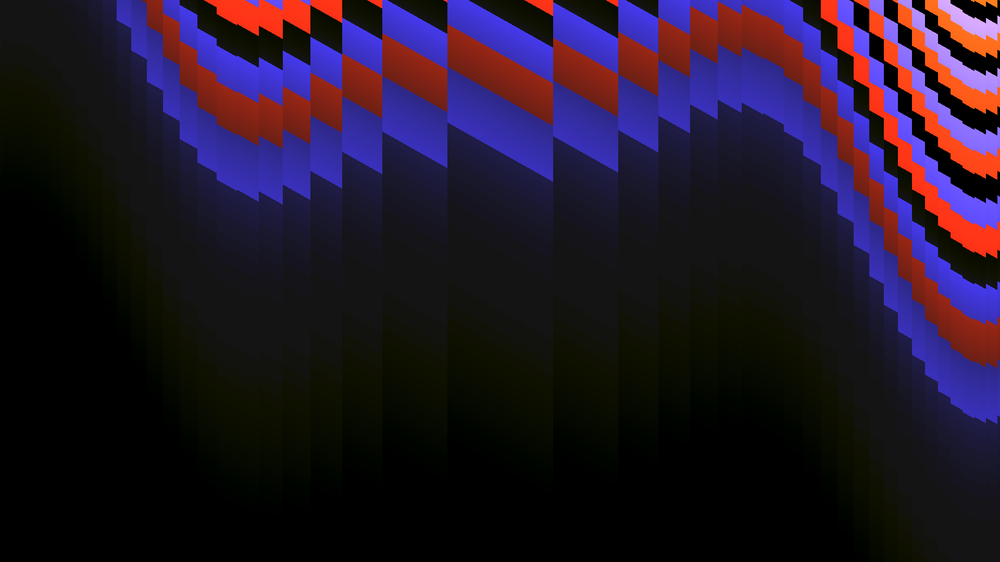

# gen_wallpaper

A ideia desse projeto é gerar de forma simples e rápida planos de fundos, mas sem perder a beleza e o estilo que seu plano de fundo prescisa :P

Algunes exemplos de imagens geradas pelo programa são

**Imagem em 4k do tipo `dots` usando a semente "335811871"**

**Imagem em 4k do tipo `xyz` usando a semente "496775472"**

**Imagem em full-HD do tipo `dots` usando a semente "496775472"**

**Imagem em full-HD do tipo `xyz` usando a semente "85287399"**


Há ainda mais exmplos no diretório [imgs](./imgs/).

## Como usar:

O comando para gerar uma imagem é bastante simples, mas antes é importante saber que há tipos de papais de parede para serem gerados. Assim, se deseja gerar uma imagem em full HD do tipo `random`, basta executar:
```sh
gen-wallpaper random meu-wallpaper.png -r full-hd
```
O comando gerará a imagem e devolvera, na saída padrão, a semente da imagem. A semente pode ser útil para falar para um amigo: "o *fundo* 137 do tipo `xyz` é bonito demais". Na falta de amigos, outra ultilidade das sementes é aumentar a resolução de uma imagem. No caso anterior, se desejasse colocar a mesma imagem em 4k bastaria rodar o comando novamente, porém agora com a semente entregue pelo ultimo programa:
```sh
gen-wallpaper random meu-wallpaper.png -r 4k -s <SEED>
```

### Plano de fundo do tipo `dots`
O tipo `dots` gera pontos seguindo uma distribuição interessante de pontos, para gerar uma imagem com esse padrão basta executar o comando:
```sh
gen-wallpaper dots meu-wallpapar-com-belos-pontos.png
```

### Plano de fundo do tipo `xyz`
No tipo `xyz`, para cada pixel da imagem, aplicamos uma função que da uma cor pra ela, os pixeis em conjunto formam padrões bastantes agradáveis. Execute o comando abaixo para gerar imagens desse tipo:
```sh
gen-wallpaper xyz imagem-que-por-pouco-nao-enquadro.png
```

### Plano de fundo do tipo `random`
No tipo `random`, geram imagens dos outros tipos de forma aleatória. Execute o comando abaixo para gerar imagens desse tipo:
```sh
gen-wallpaper random isso-ta-bem-aleatorio.png
```
